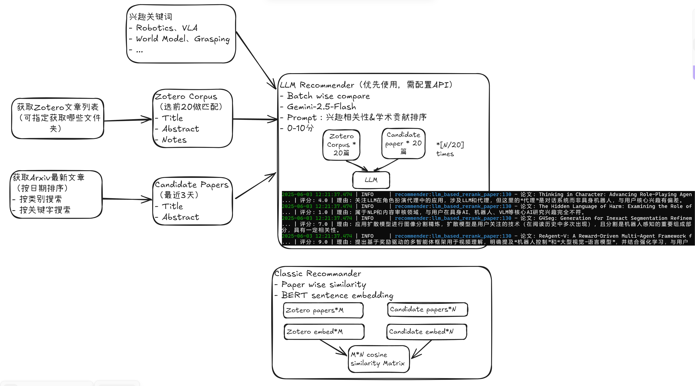

# LLM智能推荐算法



## 概述

LLM推荐算法使用大语言模型（Gemini/GPT）智能评估论文相关性，相比传统嵌入方法具有：

- **更好的语义理解**：深层理解论文与研究兴趣的关联
- **个性化推荐**：基于历史阅读偏好进行推荐
- **详细评分理由**：提供1-10分评分和解释
- **灵活配置**：支持YAML文件自定义参数
- **作者机构感知**：考虑论文作者机构背景

## 快速开始

### 1. 获取API密钥
- **Gemini API**（推荐）：[Google AI Studio](https://aistudio.google.com/) 免费获取
- **OpenAI API**：[OpenAI Platform](https://platform.openai.com/) 

### 2. 设置环境变量
```bash
# Gemini API（推荐）
export USE_LLM_API=true
export OPENAI_API_KEY="your-gemini-api-key"
export OPENAI_API_BASE="https://generativelanguage.googleapis.com/v1beta/openai/"
export MODEL_NAME="gemini-2.0-flash"

# 或使用OpenAI API
export OPENAI_API_KEY="your-openai-api-key"
export MODEL_NAME="gpt-4o"
```

### 3. 创建配置文件（可选）
在项目根目录创建 `private_config.yaml`：
```yaml
LLM_RECOMMENDER:
  RESEARCH_INTERESTS:
    - "embodied AI"
    - "robotics"
    - "multimodal learning"
  CORPUS_BATCH_SIZE: 20    # 参考论文数量
  CANDIDATE_BATCH_SIZE: 8  # 批处理大小
  KEYWORD_BONUS: 2.0       # 关键词加分
```

### 4. 运行测试
```bash
python test_llm_recommender.py
```

## 配置说明

### 研究兴趣（可自定义）
默认支持：embodied AI, robotics, world model, multimodal learning, vision-language models, robot learning, autonomous agents, reinforcement learning, computer vision, natural language processing, robot manipulation, robot navigation, imitation learning

### 评分标准
- **9-10分**：高度相关，重要学术价值
- **7-8分**：相关，值得关注  
- **5-6分**：部分相关，有参考价值
- **3-4分**：相关性较低
- **1-2分**：基本不相关

### 主要参数

| 参数 | 默认值 | 说明 |
|------|--------|------|
| `RESEARCH_INTERESTS` | 内置列表 | 研究兴趣领域 |
| `CORPUS_BATCH_SIZE` | 20 | 参考历史论文数量 |
| `CANDIDATE_BATCH_SIZE` | 8 | 每批处理论文数量 |
| `KEYWORD_BONUS` | 2.0 | 关键词匹配加分 |

## 使用方法

启用LLM推荐：
```bash
python main.py --use_llm_api=true --zotero_id=your_id --zotero_key=your_key --arxiv_query=cs.AI
```

## 性能调优

### 成本优化
```yaml
LLM_RECOMMENDER:
  CORPUS_BATCH_SIZE: 10    # 减少参考论文
  CANDIDATE_BATCH_SIZE: 12 # 增大批处理
```

### 精度优化  
```yaml
LLM_RECOMMENDER:
  CORPUS_BATCH_SIZE: 30    # 更多历史参考
  CANDIDATE_BATCH_SIZE: 5  # 小批处理
```

## 常见问题

**Q: 推荐效果不理想？**
A: 增加`CORPUS_BATCH_SIZE`，调整研究兴趣描述，检查Zotero库相关论文数量

**Q: API调用失败？**  
A: 检查网络连接和API密钥，系统会自动回退到传统方法

**Q: 如何控制成本？**
A: 减少`CORPUS_BATCH_SIZE`，增大`CANDIDATE_BATCH_SIZE`

**Q: 机构信息显示"Unknown"？**
A: LaTeX格式特殊或网络问题，算法持续优化中

## 故障排除

### API连接测试
```bash
curl -H "Authorization: Bearer $OPENAI_API_KEY" "$OPENAI_API_BASE/models"
```

### 配置文件格式
```yaml
LLM_RECOMMENDER:  # 冒号后有空格
  RESEARCH_INTERESTS:  # 缩进2个空格
    - "interest 1"     # 短横线后有空格
```

## 注意事项

1. API密钥需要足够配额
2. 大量论文处理会产生API费用
3. 需要稳定网络连接
4. Gemini API在某些地区可能需要代理

## 相关链接

- [主项目README](./README.md) - 项目总体介绍
- [测试脚本](./test_llm_recommender.py) - 功能测试代码
- [Google AI Studio](https://aistudio.google.com/) - 获取Gemini API密钥

## 更新日志

- **v2.0**: 新增LLM智能推荐算法
- **v2.1**: 增加机构信息提取功能  
- **v2.2**: 支持关键词搜索和配置文件
- **v2.3**: 优化API错误处理和容错机制
- **v2.4**: 改进作者机构提取算法，支持更多论文格式 